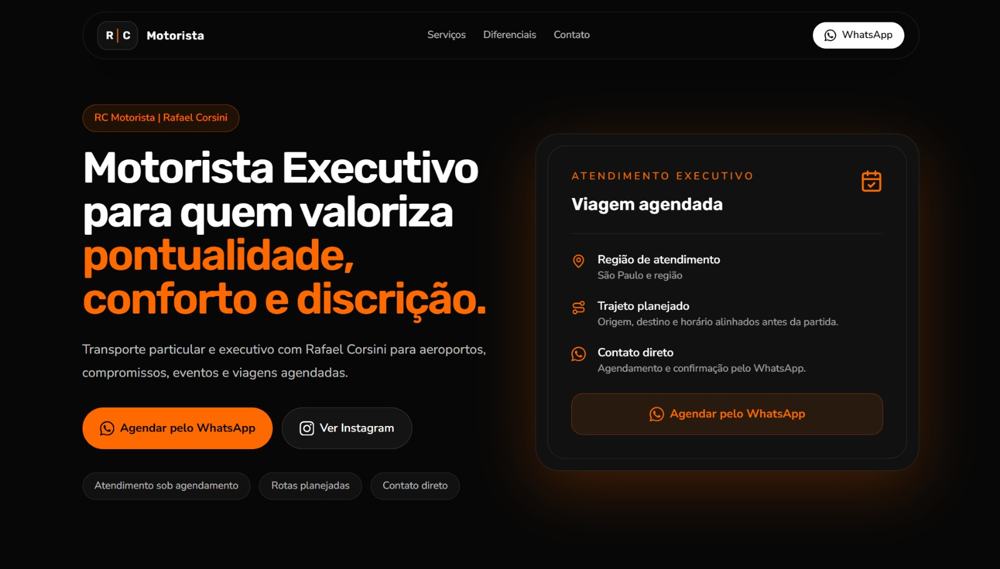

<h1>RC Motorista</h1>

<strong>Landing page profissional para transporte particular e executivo.</strong>

Uma presença digital criada para transmitir confiança, apresentar serviços com clareza e facilitar o primeiro contato pelo WhatsApp.

<a href="https://landing-page-rc-motorista.vercel.app">Ver site ao vivo</a>

## Preview principal

  

## Visão geral

A **RC Motorista**, de Rafael Corsini, precisava de uma landing page objetiva, elegante e orientada à conversão. O projeto foi desenvolvido para apresentar o serviço de transporte particular e executivo de forma profissional, destacando atributos essenciais para esse tipo de atendimento: pontualidade, discrição, conforto, segurança e contato direto.

Mais do que uma página institucional, a landing foi pensada como uma ferramenta comercial. A experiência conduz o visitante desde a proposta de valor inicial até a ação principal: iniciar uma conversa pelo WhatsApp para consultar disponibilidade e agendar o atendimento.

## Proposta de valor

A página posiciona a RC Motorista como uma alternativa confiável para clientes que precisam de deslocamentos planejados, atendimento reservado e comunicação simples. O foco está em reduzir dúvidas, reforçar credibilidade e facilitar a tomada de decisão.

- Transporte particular e executivo com atendimento sob agendamento.
- Comunicação direta com Rafael Corsini, sem intermediação genérica.
- Serviços apresentados de forma clara para diferentes necessidades de deslocamento.
- Experiência visual alinhada a uma percepção de confiança, discrição e profissionalismo.

## Estratégia de conversão

O principal objetivo da landing é transformar visitantes em contatos qualificados. Para isso, a estrutura evita excesso de informação e prioriza mensagens claras, leitura rápida e chamadas de ação bem posicionadas.

- WhatsApp como canal principal de conversão.
- CTA principal acima da dobra e repetido em pontos estratégicos.
- Navegação curta, com acesso rápido às seções essenciais.
- Conteúdo direto, sem métricas inventadas ou prova social artificial.
- Hierarquia visual pensada para destacar serviço, diferenciais e contato.

## Experiência da página

A interface utiliza uma estética dark premium para reforçar sofisticação e discrição, sem comprometer legibilidade. A construção visual combina contraste, espaçamento generoso, cards objetivos e ícones consistentes para criar uma experiência clara em desktop e mobile.

- Hero com proposta de valor direta e CTAs de contato.
- Seção de serviços para aeroportos, compromissos, eventos, viagens e atendimento recorrente.
- Galeria visual para valorizar detalhes do atendimento.
- Diferenciais com foco em pontualidade, discrição, conforto, comunicação rápida e segurança.
- Fluxo de agendamento em três etapas simples.
- Contato final com WhatsApp, Instagram, telefone e região de atendimento.

## Valor como projeto de portfólio

Este projeto demonstra a criação de uma solução digital completa para um serviço real. A landing combina posicionamento comercial, design responsivo, copy orientada à conversão e implementação moderna em React.

O resultado é uma peça de portfólio com aplicação prática: além de apresentar domínio técnico, o projeto mostra capacidade de transformar um serviço local em uma presença digital mais clara, confiável e preparada para gerar novos contatos.

## Stack

- Vite
- React
- TypeScript
- Tailwind CSS
- lucide-react

## Deploy

Site publicado em produção:

https://landing-page-rc-motorista.vercel.app

Branch de produção: `main`

## Autor

Desenvolvido por **Pedro Passos Corsini** como projeto de portfólio e produto real para a marca RC Motorista.
