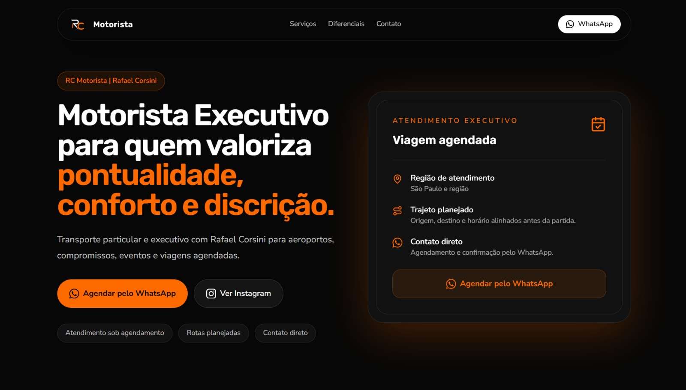

<h1>RC Motorista</h1>

<strong>Professional landing page for private and executive transportation.</strong>

A digital presence built to convey trust, present services clearly, and drive the first contact through WhatsApp.

<a href="https://landing-page-rc-motorista.vercel.app">View live site</a>

## Preview

  

## Overview

RC Motorista, run by Rafael Corsini, needed a clean, conversion-focused landing page to present a private and executive transportation service, highlighting punctuality, discretion, comfort, safety, and direct contact. The page guides visitors from the value proposition straight to the main action: starting a WhatsApp conversation to check availability and schedule a ride.

## Key Sections

- Hero with a direct value proposition and contact CTAs
- Services for airport transfers, appointments, events, trips, and recurring rides
- Photo gallery highlighting the service
- Differentiators: punctuality, discretion, comfort, fast communication, safety
- Three-step booking flow
- Footer with WhatsApp, Instagram, phone number, and service area

## Tech Stack

- Vite
- React
- TypeScript
- Tailwind CSS
- lucide-react

## Deploy

Live at https://landing-page-rc-motorista.vercel.app
Production branch: `main`

## Author

Built by **[Pedro Passos Corsini](https://github.com/pedropcorsini)** as a portfolio project and real product for the RC Motorista brand.
